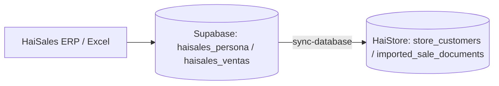

# Integración HaiSales ↔ HaiStore

**HaiSales** es el ERP de Haitech. La sincronización usa **Supabase** como base espejo (igual que HaiSupport) y replica hacia las tablas operativas de HaiStore.

## Arquitectura



| Capa | Tablas |
|------|--------|
| Espejo HaiSales | `haisales_persona`, `haisales_ventas` |
| HaiStore | `store_customers`, `imported_sale_documents` |

## Autenticación

Mismo Supabase Auth que HaiStore y HaiSupport. Cuentas ERP/admin: `ventas@haitech.pe` / `demo123`. Ver [`docs/haitech-auth-unified.md`](./haitech-auth-unified.md).

## Variables de entorno

```env
# Por defecto = mismo proyecto que HaiStore
SUPABASE_URL=https://xxx.supabase.co
SUPABASE_SERVICE_ROLE_KEY=...

# Proyecto Supabase dedicado a HaiSales (opcional)
HAISALES_API_URL=https://yyy.supabase.co
HAISALES_API_KEY=service_role_...

# Nombres de tabla si difieren en tu ERP
HAISALES_TABLE_PERSONA=haisales_persona
HAISALES_TABLE_VENTAS=haisales_ventas

HAISALES_WEBHOOK_SECRET=secreto-compartido
```

## Migraciones Supabase (HaiStore)

1. `011_imported_sale_documents.sql` — histórico de ventas en tienda  
2. `012_haisales_mirror_tables.sql` — espejo ERP  

```bash
node scripts/apply-supabase-migration.mjs supabase/migrations/012_haisales_mirror_tables.sql
```

## API (admin)

| Método | Ruta | Descripción |
|--------|------|-------------|
| GET | `/api/integrations/haisales/status` | Estado, conteos espejo y tienda |
| POST | `/api/integrations/haisales/sync-database` | Lee espejo → actualiza HaiStore |
| POST | `/api/integrations/haisales/sync-seeds` | Excel en `data/seeds` → espejo → HaiStore |
| POST | `/api/integrations/haisales/import/persona` | Subir Excel Persona |
| POST | `/api/integrations/haisales/import/ventas` | Subir Excel Ventas |

`sync-database` acepta `{ "mirrorRemote": true }` si `HAISALES_API_URL` apunta a otro proyecto: copia el espejo remoto al local antes de sincronizar.

## Scripts

```bash
npm run haisales:sync   # Excel → espejo → HaiStore
```

## UI

- **Configuración → Integraciones**: **Sincronizar base** y **Excel → base**
- **Ventas → Sincronizar HaiSales**
- **CRM → Resumen**: KPIs del histórico importado

## Escribir en el espejo desde el ERP

El ERP (o un job) puede insertar/actualizar filas en `haisales_persona` (columnas del reporte Persona) y `haisales_ventas` (`external_key`, `invoice_date`, `report_period_month`, `payload` jsonb con columnas del reporte Ventas). Luego en HaiStore pulsa **Sincronizar base** o llama a `POST /sync-database`.

## Relación con HaiSupport

| Sistema | Datos |
|---------|--------|
| HaiSales | Clientes Persona + comprobantes de venta |
| HaiSupport | Soporte, servicios, alquileres |

Tras importar un cliente desde HaiSales, `ensureStoreCustomerFromHaitechClient` puede replicarlo a HaiSupport si `HAISUPPORT_API_*` está configurado.
